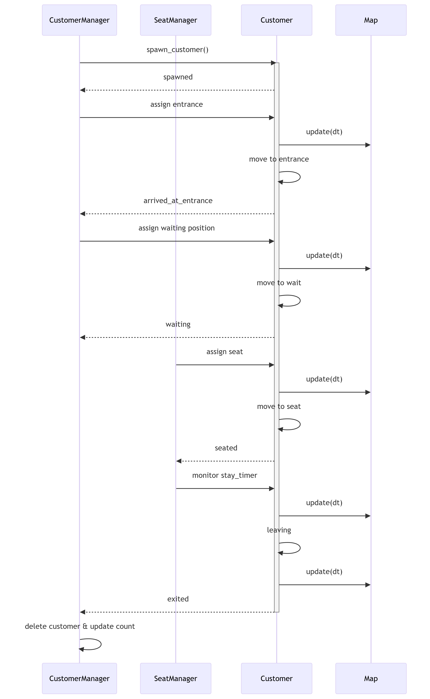

 **顧客ライフサイクル** 

---

# 顧客状態とManager対応

## 1️⃣ 状態管理と担当者

| Customer.state         | 意味            | 管理者 / 処理担当                    | 処理内容                                     |
| ---------------------- | ------------- | ----------------------------- | ---------------------------------------- |
| `spawned`              | 新規生成          | CustomerManager               | 顧客生成、店外初期位置設定                            |
| `assigned_to_entrance` | 入口割当          | CustomerManager               | 入口座標割当、`target_pos` 設定                   |
| `moving_to_entrance`   | 入口まで移動中       | Customer                      | `update(dt, map)` による移動                  |
| `arrived_at_entrance`  | 入口到着          | Customer + CustomerManager    | 移動完了判定、次状態 `moving_to_wait`              |
| `moving_to_wait`       | 待機場所移動中       | CustomerManager + Customer    | 空いているWポジション割当、移動開始                       |
| `waiting`              | 待機中           | CustomerManager               | 座席が空くまで待機                                |
| `moving_to_seat`       | 座席移動中         | SeatManager + Customer        | 空き座席割当、移動開始                              |
| `seated`               | 着席            | SeatManager                   | 食事タイマー開始 (`stay_timer`)                  |
| `leaving`              | 退店中           | SeatManager + Customer        | 食事終了後、出口座標割当、移動開始                        |
| `exited`               | 出口到着          | SeatManager + CustomerManager | 移動完了判定、座席解放                              |
| `customer_deleted`     | 顧客削除 & カウント更新 | CustomerManager               | 顧客リスト削除、来客カウント更新 (`customer_count += 1`) |

---

## 2️⃣ 顧客ライフサイクル シーケンス図

---

### 🔹 ポイント

* **表**で状態管理と担当者を明示
* **シーケンス図**で実際の呼び出しや状態遷移を追える
* CustomerManagerは「入口割当・待機管理・削除」
* SeatManagerは「座席割当・着席・退店管理」
* Customerは「移動・アニメーション・位置更新」

---

